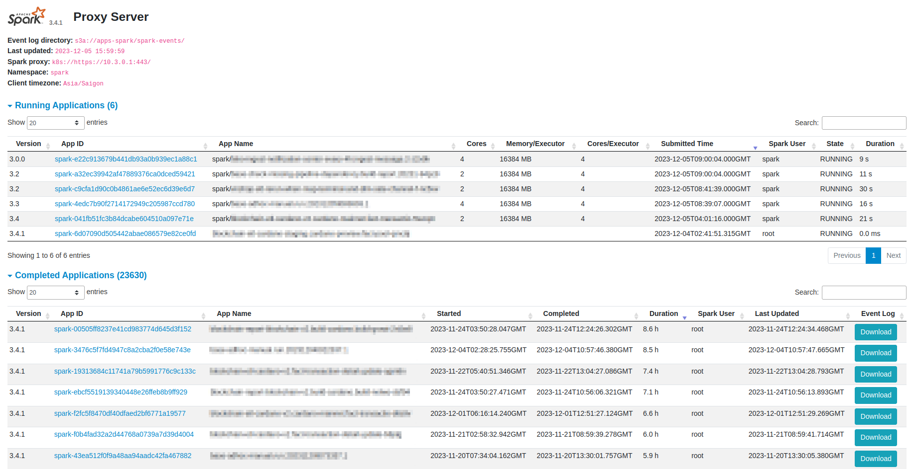

`spark-proxy`
=============
The Spark Proxy server extends the Spark History server by proxy live running [SparkApp on Kubernetes](https://github.com/GoogleCloudPlatform/spark-on-k8s-operator) 
alongside with provides application history from event logs stored in the file system.



## Installation
```bash
helm install spark-proxy oci://ghcr.io/dungdm93/helm/spark-proxy:1.0.0 -f <values.yaml>
```

### Helm parameters
* `spark-proxy` accept any [Spark configuration](https://spark.apache.org/docs/latest/configuration.html) in the `sparkConfig` field, e.g:
    ```yaml
    sparkConfig:
      spark.history.ui.port: 18080
      spark.history.fs.logDirectory: hdfs://apps/spark/spark-events/
      spark.history.fs.cleaner.enabled: true
      spark.history.fs.cleaner.interval: 1d
      spark.history.fs.cleaner.maxAge: 15d
      spark.history.store.serializer: PROTOBUF
      spark.history.store.hybridStore.enabled: true
      spark.history.store.hybridStore.diskBackend: ROCKSDB
      spark.history.store.maxDiskUsage: 8g
    ```
* The configuration settings for `spark-proxy` are located within the `sparkProxyConfig` session.
    Currently, only the `kubernetes` provider is supported. By default, `spark-proxy` monitors SparkApps across all namespaces.
    If you want to limit the monitoring to SparkApps in a specific namespace, you can freely define the `sparkProxyConfig.kubernetes.namespace` property.

### Customize docker image
The outcome of the `spark-proxy` build comprises only two JAR files, which you can incorporate into your custom Docker image.
For simplicity, just modify the `BASE_IMAGE` build argument as bellow.

```bash
docker build -f deploy/Dockerfile -t <your-image> --build-arg BASE_IMAGE=<your-base-image> .
```
